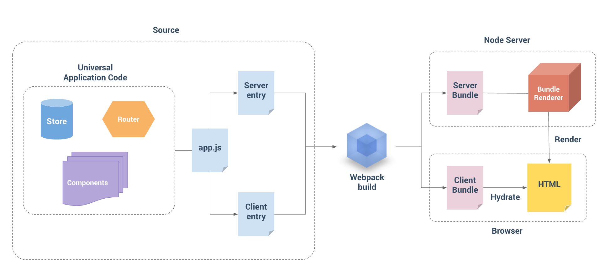

> これは Hackernews のオフィシャル Firebase API に基づいた Hackernews クローンで、Vue 2.0 + Vue Router + Vuex 、そしてサーバサイドレンダリングが使用されています。



  


 

> [ライブデモ](https://vue-hn.now.sh/)
> 注意: 一定期間誰もアクセスしていなかった場合、デモはスピンアップ時間を要するかもしれません。
>
> [[ソース](https://github.com/vuejs/vue-hackernews-2.0)]

## 機能
- サーバサイドレンダリング
  - Vue + Vue Router + Vuex と一緒に使用
  - サーバサイドのデータのプリフェッチ
  - クライアントサイドの状態 & DOM ハイドレーション
- 単一ファイル Vue コンポーネント
  - 開発モードにおけるホットリロード
  - 本番向けの CSS 抽出
- FLIP アニメーションによるリアルタイムリストアップデート

## アーキテクチャ概要

